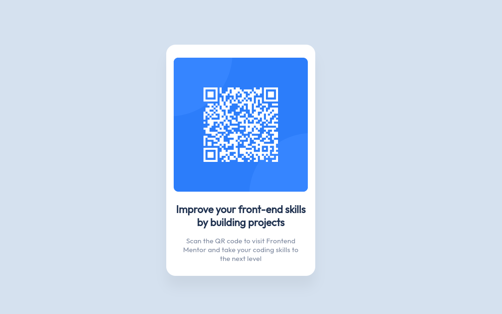

# Frontend Mentor - QR code component solution

This is a solution to the [QR code component challenge on Frontend Mentor](https://www.frontendmentor.io/challenges/qr-code-component-iux_sIO_H). Frontend Mentor challenges help you improve your coding skills by building realistic projects.

## Table of contents

- [Frontend Mentor - QR code component solution](#frontend-mentor---qr-code-component-solution)
  - [Table of contents](#table-of-contents)
  - [Overview](#overview)
    - [Screenshot](#screenshot)
    - [Links](#links)
  - [My process](#my-process)
    - [Built with](#built-with)
  - [Author](#author)

**Note: Delete this note and update the table of contents based on what sections you keep.**

## Overview

### Screenshot

### Links

- Solution URL: [QR_component](https://github.com/malopez1578/QR_component)
- Live Site URL: [Live site QR_component](https://malopez1578.github.io/QR_component/)

## My process

### Built with

- Semantic HTML5 markup
- CSS custom properties
- Flexbox
- [React](https://reactjs.org/) - JS library
- [vite.js](https://vitejs.dev/) - For building
- [Sass](https://sass-lang.com/) - For styles

## Author

- Github - [@malopez1578](https://github.com/malopez1578)
- Frontend Mentor - [@malopez1578](https://www.frontendmentor.io/profile/malopez1578)
- Twitter - [@malopez1578](https://www.twitter.com/malopez1578)
